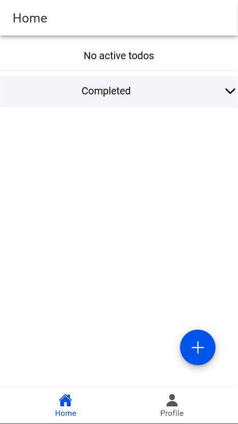
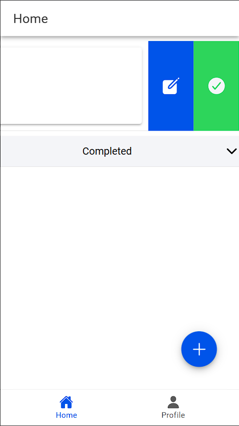
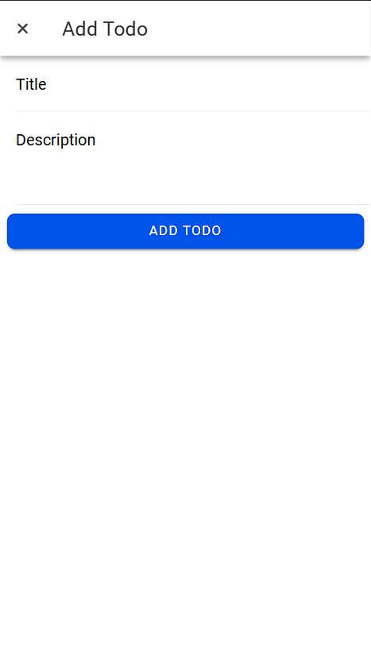
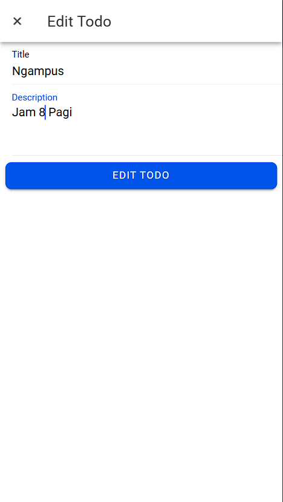
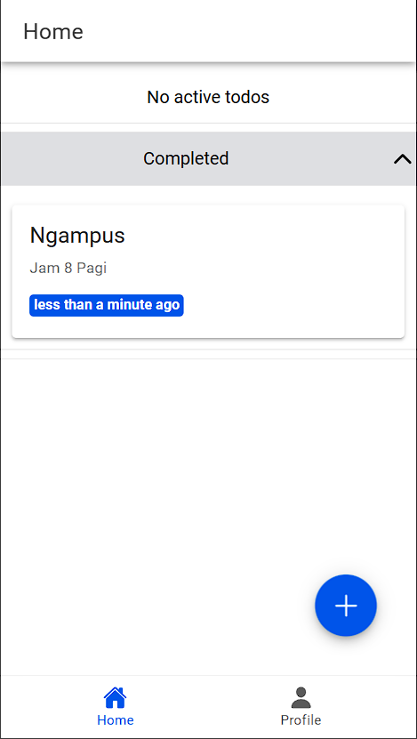
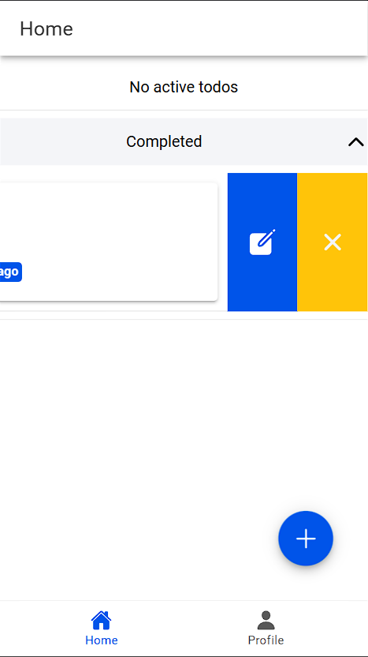
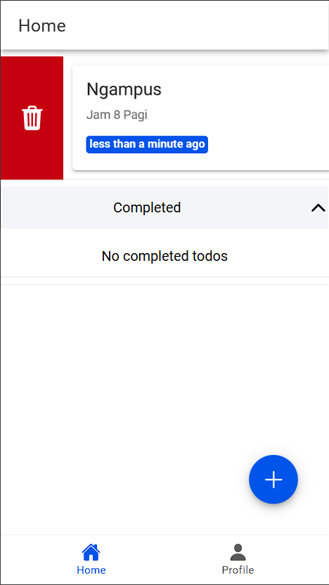

# Todo List App with Firestore

Todo List App dibuat dengan Ionic dan terintegrasi dengan Firebase Firestore. Merupakan pengembangan lanjutan dari Ionic-vue-firebase.

## Screenshots

### Home Screen v2
 | 
Menampilkan todo aktif dan yang telah selesai. Fitur-fitur utama meliputi:
- Floating action button (`+`) untuk menambahkan todo baru.
- Todo list dengan swipe gesture untuk quick action seperti mengedit, menyelesaikan, atau menghapus todo.
- Fungsi pull-to-refresh.

### Add Todo

Untuk menambahkan todo baru. Pengguna bisa:
- Memasukkan judul dan deskripsi todo.
- Menyimpan todo dengan mengklik tombol “Add Todo”.

### Edit Todo

Mirip dengan  “Add Todo” namun sudah diisi sebelumnya dengan rincian todo yang dipilih. Pengguna dapat:
- Memperbarui judul dan deskripsi.
- Menyimpan perubahan dengan mengeklik tombol “Edit Todo”.

### Completed Todos (Completed)
 | 
Menampilkan list todo yang telah ditandai sebagai selesai. Bagian ini:
- Dapat di-collapse untuk menghemat ruang.
- Swipe gestures yang memungkinkan pengguna untuk menghapus dan mengedit todo, serta mengembalikan status todo ke aktif.

### Delete Todo

Menghapus todo dari list todo aktif atau selesai.

