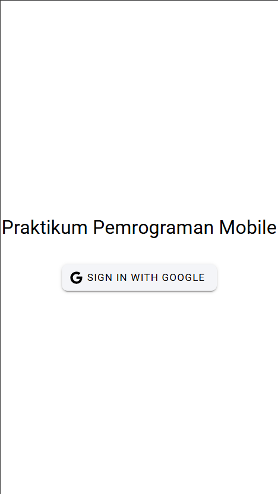
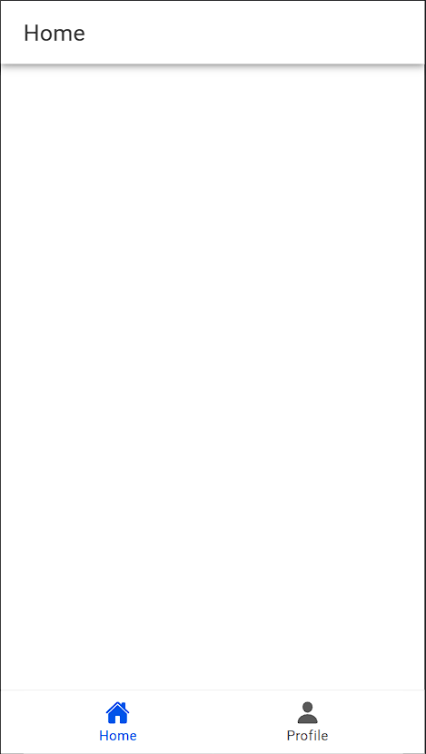
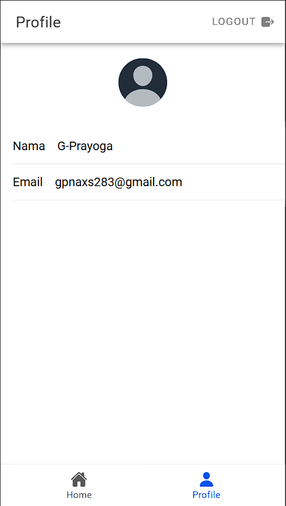

# Google Authentication with Firebase

Project ini mendemonstrasikan cara mengintegrasikan Autentikasi Google ke dalam aplikasi Ionic + Vue menggunakan Firebase.

## Screenshots

### 1. Login Screen
Halaman login memungkinkan pengguna untuk masuk dengan akun Google.



### 2. Home Screen
Setelah masuk, terdapat halaman beranda dengan opsi menu pada bagian bawah dan tombol logout pada bagian kanan atas.



### 3. Profile Screen
Halaman profil menampilkan informasi profil pengguna, termasuk nama, email, dan foto profil.




## Cara Kerja

### 1. Inisialisasi Firebase
SDK Firebase diinisialisasi di dalam file `firebase.ts`. `GoogleAuthProvider` dikonfigurasikan untuk autentikasi.

```
import { initializeApp } from "firebase/app";
import { getAuth, GoogleAuthProvider } from "firebase/auth";

const firebaseConfig = { /* your configuration */ };
const firebase = initializeApp(firebaseConfig);
const auth = getAuth(firebase);
const googleProvider = new GoogleAuthProvider();

export { auth, googleProvider };
```

### 2. Login dengan Google
Fungsi `loginWithGoogle` menangani login Google menggunakan plugin Capacitor Google Auth. Setelah autentikasi, `idToken` dikirim ke Firebase untuk memvalidasi pengguna.

```
import { GoogleAuth } from "@codetrix-studio/capacitor-google-auth";
import { GoogleAuthProvider, signInWithCredential } from "firebase/auth";
import { auth } from "../firebase";

async function loginWithGoogle() {
  const googleUser = await GoogleAuth.signIn();
  const idToken = googleUser.authentication.idToken;

  const credential = GoogleAuthProvider.credential(idToken);
  const result = await signInWithCredential(auth, credential);

  // Store user information
  return result.user;
}
```

### 3. Menyimpan Informasi User
Informasi user disimpan dalam `Pinia` untuk akses global.

```
import { defineStore } from "pinia";

export const useUserStore = defineStore("user", {
  state: () => ({
    user: null,
  }),
  actions: {
    setUser(user) {
      this.user = user;
    },
  },
});
```

### 4. Menampilkan Informasi Profil
Informasi profil ditampilkan dalam komponen `ProfilePage.vue`. Komponen ini mengambil detail pengguna dari store Pinia kemudian dimasukkan ke elemen UI.
```
<template>
  <div>
    
    <h1>{{ user.displayName }}</h1>
    <p>{{ user.email }}</p>
  </div>
</template>

<script>
import { useUserStore } from "../stores/user";

export default {
  setup() {
    const userStore = useUserStore();
    return { user: userStore.user };
  },
};
</script>
```

